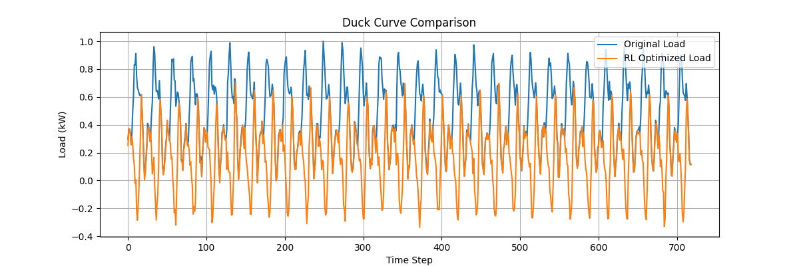
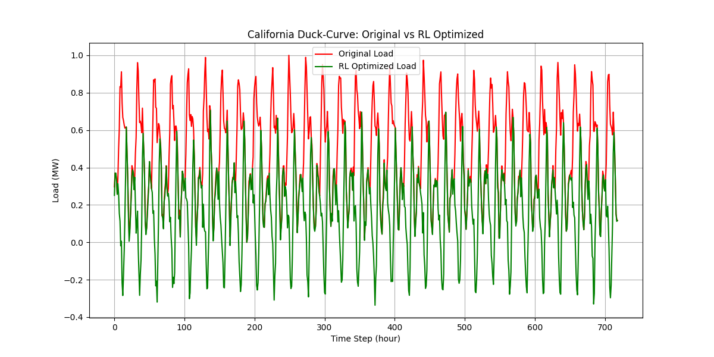

# RL-Grid-Optimizer
A RL-Grid-Optimizer is a reinforcement learning framework designed to showcase renewable energy usage and optimize it. 
It includes a Gym Scaffold environment, a PPO training pipeline, and full support for model training and duck curve data.

Featuring:
Custom RL Environment (GridEnvV2) built with Gymnasium
Battery Storage Simulation including charge/discharge rules & SOC tracking
Renewable Energy Modeling using realistic demand and solar patterns
PPO Training Integration with Stable-Baselines3
Checkpointing & Model Saving inside /models
Replay Buffer Saving for analysis
Easily extendable to real-world datasets and pandapower integration
Designed for research, experimentation, and production-grade scaling

VISUALITY:
### Duck-Curve Comparison

### RL vs. Original Optimized

Environment Components:
Demand curve: Hourly load from duck-curve patterns
Solar generation: synthetic used with imported dataset
Battery Storage: Capacity, SoC, and operational limit
Penalties + Rewards:
- Over-discharge 
- Grid imbalance
- Reward for demand-generation matching
- Small bonus for SoC trajection

Agent:
PPO
- learning rate: 3^10-4
- gamma = 0.99
- clip range = 0.2
The entropy regulation

IMPROVEMENTS:
- Using integration with pandapower for physicality
- Multi-agent controls
- Rela-world dataset ingestion such as CAISO
- API deployment

Faiyaz Mashrafi
Reinforcement Learning
Smart Grid Optimization Research